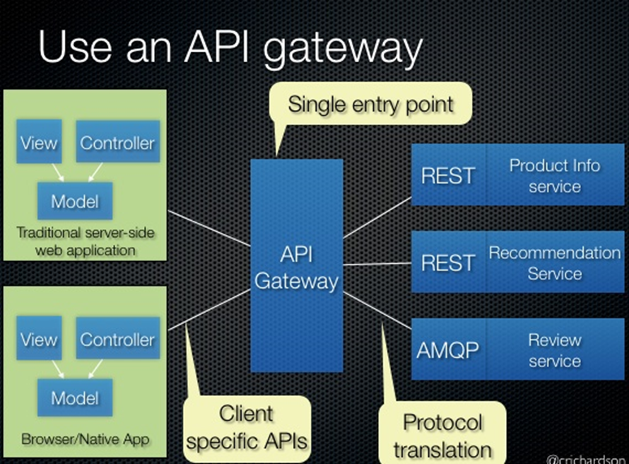
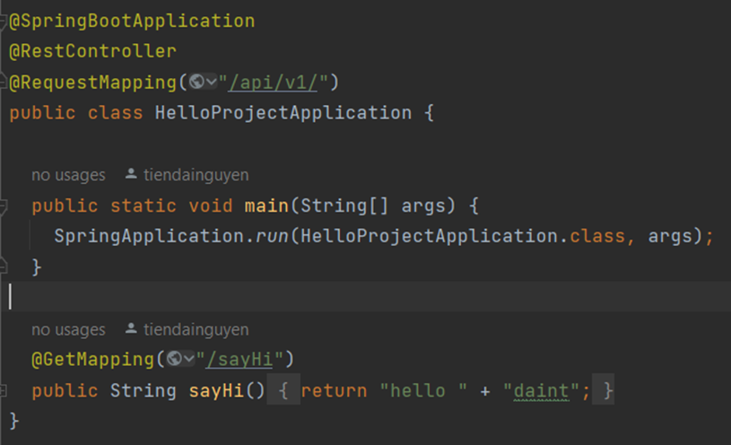
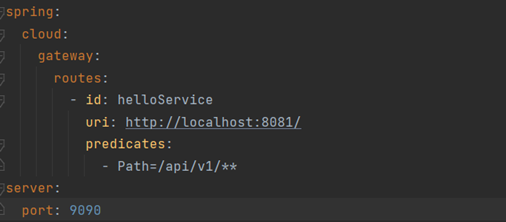
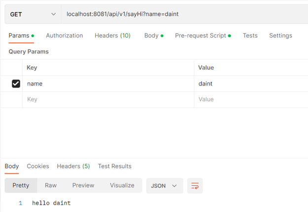
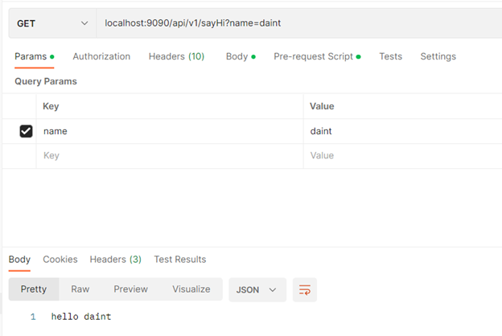

# gatewayserviceConfig-Eureka
1.	What is API Gateway?
      API Gateway hay Gateway Service là 1 dịch vụ ( 1 service trong dự án microservice ) đảm nhiệm vai trò quản lý điều hướng các Request từ phía người dùng tới các service khác trong hệ thống.

API Gateway cho phép các nhà phát triển tạo ra điểm cuối API, giúp các ứng dụng khác truy cập vào các API của hệ thống thông qua các điểm cuối này.
2.	Tại sao cần API Gateway?
      •	Lý do đầu tiên, Các hệ thống ngày nay đang sử dụng công nghệ Server-side. Tức là máy chủ front-end chạy độc lập với back-end. Bài toán đặt ra ở đây là nếu các URI dẫn tới các API phía Back-end bị thay đổi bởi 1 lý do nào đó, phía front-end sẽ xử lý ra sao? Không nhẽ cứ mỗi lần sửa đổi lại phải gọi nhau qua slack kiểu “ anh mới đổi URI tới service này, em đổi lại cho anh nhé”.
      Thì khi này, API Gateway sẽ phát huy tác dụng. API Gateway có thể được hiểu như 1 Abstraction Layer, 1 bản thiết kế mô tả các điều hướng tới các dịch vụ. Khi có bất kì thay đổi nào phía back-end, ta có thể cập nhật lại mô tả lên lớp này. Và từ đó front-end vẫn có thể chạy mượt mà mà không cần quan tâm ông back-end ông vừa sửa gì 
      •	Lý do thứ 2, Bảo mật. Vì các microservice được phát triển độc lập và có thể chạy trên nhiều máy chủ khác nhau, vì vậy, nếu một microservice không được bảo mật tốt, thì nó có thể trở thành một điểm yếu cho toàn bộ hệ thống. Khi sử dụng API gateway để bảo mật, các yêu cầu có thể được kiểm soát và định tuyến đến microservice phù hợp, và các chức năng bảo mật có thể được thực hiện tập trung tại API gateway, giúp đảm bảo rằng toàn bộ hệ thống được bảo mật tốt hơn.
      •	Lý do thứ 3, Cân bằng tải. Ví dụ chúng ta có 2 phiên bản của cùng dịch vụ được cài đặt tại các cổng khác nhau. Khi 1 yêu cầu được gọi tới dịch vụ này, 2 phiên bản sẽ được Service Registry trả về cho API Gateway, cơ chế cân bằng tải sẽ hoạt động. Xác định xem nên sử dụng dịch vụ này ở phiên bản nào
3.	Cách triển khai API Gateway sử dụng Spring Cloud Gateway.
      Trước hết, ta cần có 1 dịch vụ cần định tuyến tới, ví dụ ở đây là helloService

Triển khai API Gateway ( Gateway Service )
B1: import Spring Cloud Gateway Library

B2: Cấu hình routes cho các API mà nó định tuyến tới

-	id: id của mỗi service, mỗi service khác nhau sẽ được đặt id khác nhau ( cái này mình tự đặt )
-	uri: địa chỉ định danh của kho tài nguyên ( host + port)
-	Path: địa chỉ của mỗi service trong kho tài nguyên ( controller )
     B3: Tiến hành bypass dịch vụ:
-	Để gọi trực tiếp đến dịch vụ, ta sử dụng cổng 8081

-	Tuy nhiên, ta có thể tiến hành gọi dịch vụ thông qua API Gateway bằng cổng 9090 của API Gateway
 
 
